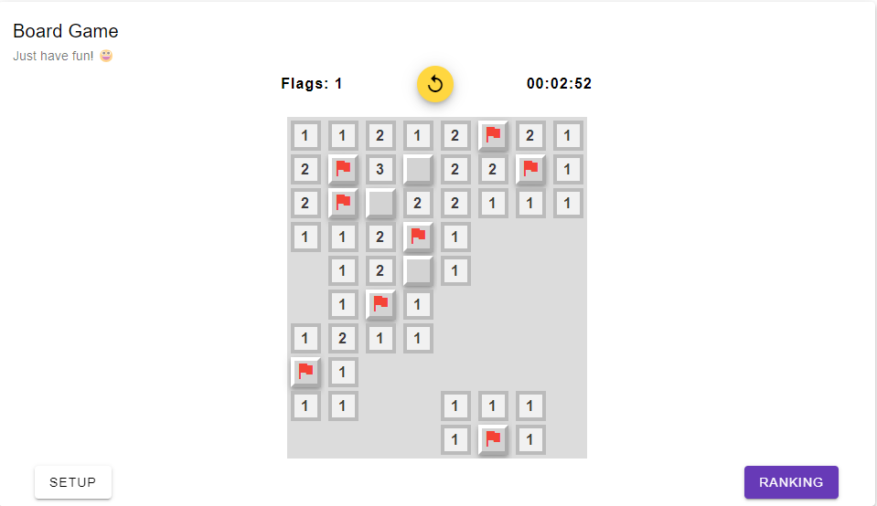
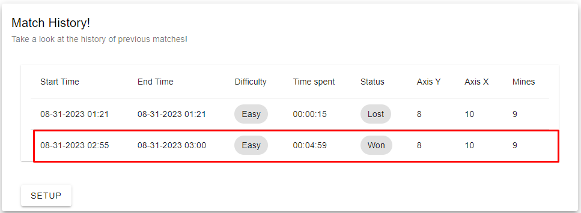
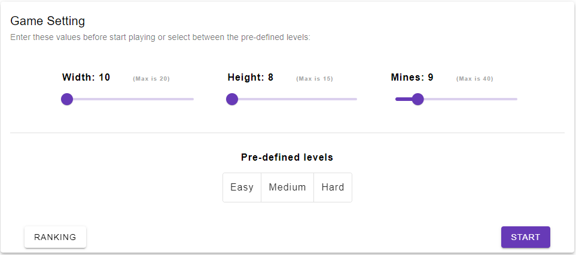

# Minesweeper Game | Angular Signals + NestJs + Mongo

✨ **This project is about the classic minesweeper game, in which I take the opportunity to use version 16 of Angular to learn and study the new feature released to manage state on the frontend, called [Angular Signals.](https://angular.io/guide/signals)** ✨





## Technical details

**In this project I'm using Monorepo powered by Nx. [Nx is a fast and extensible build system.](https://nx.dev)**

### Stack:

- `Angular 16 framework for frontend`
- `Angular signals to manage the state of the frontend`
- `Simple NodeJs API, using NestJs`
- `Mongo for the database.`
  <br />
  <br />

First of all, make sure you have nx available in your terminal. If not install it by running this command:

```
npm install -g nx
```

To get all project dependencies run:

```
npm install
```

## Frontend:

To run the frontend app use the command: `nx serve frontend`

To customize the project and create new libs, components, services, etc. take a look at [the Nx documentation](https://nx.dev/plugin-features/use-code-generators), or use the Angular CLI.

## Unit Testing

**To unit test this project I'm using Jest both front and backend.**

- To test the service lib, for example, run: `nx test services`

- To test the backend app, run: `nx test backend`

- To see the coverage, run `nx test services --coverage`

Take a look at the coverage folder.

## Linting

**On this project I'm using ESlint as well**

- To lint the services lib, for example, run: `nx run services:lint --fix`

- To lint the backend app, run: `nx run backend:lint --fix`

## Backend project:

**Is simple NodeJs API implemented using NestJs.**

- To run the Backend app run the comand `nx serve frontend`

If you are not using a database, and want to persist your matches, please go to the file: `apps\backend\src\app\app.controller.ts` and and follow the instructions in the comments there. But FYI the matches will persist in the memory of the API, once you stop the API and run again, you will lose the data.
